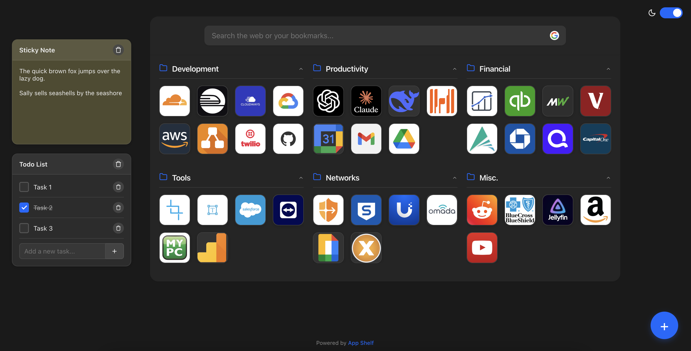

# App Shelf

A clean, modern Chrome extension that replaces your new tab page with a customizable bookmarks dashboard.



## Features

- **Organized Bookmarks**: Group your bookmarks in customizable folders
- **Clean Interface**: Minimalist design focuses on your content
- **Quick Search**: Search the web or your bookmarks directly from the new tab page
- **Dark Mode**: Toggle between light and dark themes
- **Import/Export**: Easily backup and restore your bookmark collections
- **Keyboard Shortcuts**: Navigate efficiently with keyboard shortcuts

## Installation

### From Chrome Web Store

1. Visit the [Chrome Web Store](https://chrome.google.com/webstore/) (Coming Soon)
2. Click "Add to Chrome"
3. Confirm the installation

### Manual Installation

1. Download or clone this repository
2. Open Chrome and navigate to `chrome://extensions/`
3. Enable "Developer mode" in the top-right corner
4. Click "Load unpacked" and select the app-shelf directory
5. The extension is now installed and will replace your new tab page

## Usage

### Adding Bookmarks

1. Click the "+" button in the bottom-right corner
2. Select "Add Bookmark"
3. Enter the name and URL
4. Choose a folder (or leave in "Unorganized")
5. Click "Add Bookmark"

### Managing Folders

1. Click the "+" button in the bottom-right corner
2. Select "Add Folder"
3. Enter a name and unique ID for your folder
4. Click "Add Folder"

### Keyboard Shortcuts

- `Ctrl/Cmd + D`: Add a new bookmark
- `Ctrl/Cmd + F`: Add a new folder
- `Ctrl/Cmd + S`: Export bookmarks
- `Esc`: Close popups

## File Structure

```
app-shelf/
├── manifest.json               # Extension manifest
├── newtab.html                 # Main HTML entry point
├── newtab.js                   # Main JavaScript entry point
├── css/                        # Stylesheets
│   ├── main.css                # Main CSS entry point
│   └── ...                     # Component-specific CSS files
├── js/                         # JavaScript files
│   ├── app.js                  # Main application controller
│   ├── modules/                # Core functionality modules
│   └── components/             # UI components
└── assets/                     # Icons and images
    └── icons/                  # Extension icons
```

## Development

App Shelf is built with vanilla JavaScript using ES6 modules for better organization.

To contribute:
1. Fork the repository
2. Make your changes
3. Test thoroughly with Chrome's extension tools
4. Submit a pull request

## License

[MIT License](LICENSE)

## Credits

Developed by App Shelf Team
